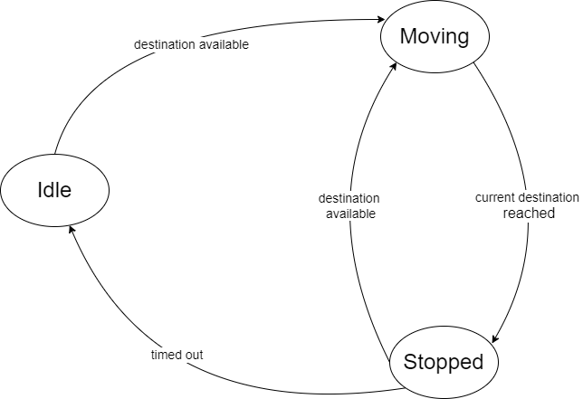

# Elevator system design

A small project on designing an elevator system with a little bit of simulation

### How to Run the Code

To run the code, follow these steps:
```
cd python
python main.py
```


### Design

#### Event sequence
When a passenger calls an elevator by pressing the button, the sequence of events involves:

- Button pressed: the elevator control system receives a signal.
- The control system decides which elevator car will respond to the call based on various algorithms.
- An elevator is dispatched to the passenger's current location.
- The passenger enters the elevator car.
- The elevator control system waits for a predefined period or until sensors confirm that the door area is clear of obstacles before closing the doors. Inside the elevator car, the passenger selects their desired destination floor by pressing the corresponding button on the car's control panel.
- The elevator car stops precisely at the destination floor, and the doors open to allow the passenger to exit.
- The elevator control system returns the elevator car to an idle state, ready to respond to the next call.

#### Objects
From the sequence of events, we will design an simulation of such system consisting of the following object classes:

- Elevator
- Control System
- Floor
- Button
	- Call button
	- Go-to button

For a simple simulation, we consider floors as integers and button's commands will be terminal input.
- Command to call the elevator for going up from the 7th floor
```bash
call 7 up
```
- Command to enter new destination for the 2nd elevator to go to the 9th floor
```bash
goto 2 9
```
For each command, the elevator control system will send a destination to an associated elevator. The destination will then be added into a set of destinations by the elevator for later processing.
#### State machine of an elevator

Describing an elevator as a finite-state machine (FSM) involves defining the different states it can be in, as well as the events or inputs that cause transitions between these states. 

##### States
1. **Idle**: The elevator is stationary at a floor with doors closed, waiting for a call.
2. **Moving**: The elevator is traveling toward a requested floor.
3. **Stopped**: The elevator arrived at a destination, its door is opened and the elevator is waiting for next commands.

##### Transition between states
- **Call command processed**: when a call command is processed, the elevator determines the next destination and change its state from **Idle** to **Moving**.
- **Arriving at floor**: When the elevator reaches the desired floor, it transitions from **Moving** to **Stopped**. The current floor will be remove from the set of the destination set.
- When an elevator is at **Stopped** state, it will remains stopped for 5 seconds before entering its next state:
	- If there are still destination in the destination set, the elevator selects the next destination and change to **Moving**.
	- Otherwise, it becomes **Idle**.



#### Design choice
##### Language
Python
##### State machine
In the *Elevator* class, we have functions:
- idle()
- move()
- stop()

##### Fetching destination from command board to elevators
An elevator does not know where to go if there are no command issued by the control system. Designing an elevator requires a mechanism to receive and process such commands.

Whether a command is a *call* command or a *goto* command, when it is dispatched to an elevator, it consists of new destination for the elevator to go. Hence, an elevator will have an event loop which will notify whenever a new destination is received. The event will be used to trigger transitions between states. The design choice for this type of event is ``asynio.Event``.

